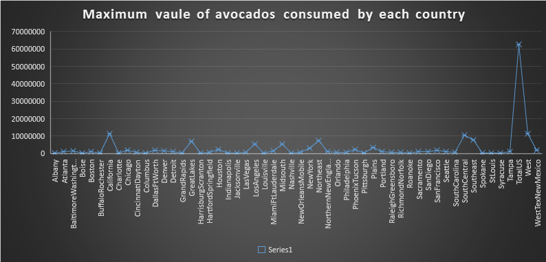
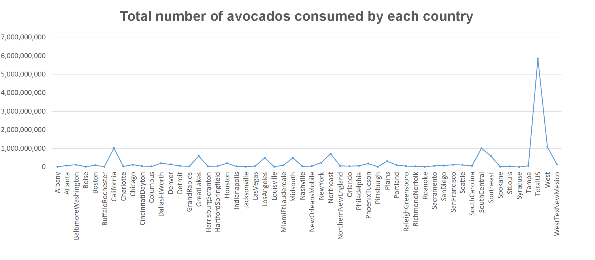

# avocado-map-reduce
## 44517 BIG DATA- Section 02
## Group 5
## Developers: 
### 1. Bhagya Sree Chanda
### 2. Nikitha Lakmarapu
#### Course Description: Design and implementation of data intensive systems covering common approaches to processing big data at rest and data in motion. Using MapReduce: Simplified Data Processing on Large Clusters. An introduction to the design of data-intensive, reliable, scalable, and maintainable systems. This may include concepts such as parallel programming, distributed computing, distributed file systems, MapReduce, regular expressions, and the ingesting and processing of data at-rest and data in motion. Tools used may include Hadoop, HDFS, Pig, Hive, Spark, Storm, Kafka, Mahout, MLlib, etc

## Links:
### 1. Shared public repo- https://github.com/bhagyasree2895/avocado-map-reduce
### 2. IssueTracker link- https://github.com/bhagyasree2895/avocado-map-reduce/issues
The dataset we choose is Avocado prices and want to see prices of avocado in each region of united states.

## Introduction: 
##### It's also a well known fact that all Millenials live in their parents basements. Clearly, they aren't buying home because they are buying too much Avocado Toast!

## Data Source:
#### link to Actual data source: https://www.kaggle.com/neuromusic/avocado-prices
     - This data-set of Avocado Prices has 14 columns and nearly 20,000 rows. 
     - The data is scraped in the csv file. 
     - The data-set which I took is structured data which is in the Excel format. 
     - The volume of the data is around 2 MB. 
     - The velocity of this data-set is pretty slow, since it's just the information recorded once for the year for each country. 
     - The data is not messy and  clean.
## Requirements:
     - Install python3 version
     - Install visual studio code
     - Install power shell
     - Install MS Excel
## Sequence of steps for execution:
     - Select a structured data set from https://www.kaggle.com which is in csv format.
     - Make sure python is installed using command prompt using command: python
     - Create mapper and reducer python files for each problem and write relevant code into them.
     - In a developer folder open powershell here as administrator.
     - In powershell write command : python mapper.py
     - After running mapper.py, run reducer.py file using command: python reducer.py
     - Solution for the problem will be saved in reducerout.txt file.
     - Copy the text from the reducerout.txt file and paste it in excel sheet.
     - Select the data in excel sheet and go to insert to generate graph or chart.
     - Select a best suitable graph type and generate the graph for the corresponding data.

## Big Data problems:

### Bhagya Sree Chanda:
#### Problem: For each country, find the maximum voume of consumed volume of avocado
##### - Mapper input: 0	12/27/2015	1.33	64236.62	1036.74	54454.85	48.16	8696.87	8603.62	93.25	0	conventional	2015	Albany
##### - Mapper output: Key is Country (Albany): Value is total volume(64236.62)
              - Albany 64236.62
              - Albany 54876.98
              - Albany 118220.22
              - Albany 78992.15
              - Albany 51039.6
##### - Reducer output: Key is Country (Albany): Value is total volume(118220.22) {here the value as volume would be maximum of all volumes for a particular country(Albany)
              - Albany 118220.2
##### - Chart: Box and whisker graph

### Nikitha Lakmarapu: 
#### Problem: For each country, find the sum of consumed volume of avocado.
##### - Mapper input: 0	12/27/2015	1.33	64236.62	1036.74	54454.85	48.16	8696.87	8603.62	93.25	0	conventional	2015	Albany
##### - Mapper output: Key is Country (Albany): Value is total volume(64236.62)
              - Albany 64236.62
              - Albany 54876.98
              - Albany 118220.22
              - Albany 78992.15
              - Albany 51039.6
##### - Reducer output: Key is Country (Albany): Value is total volume(367365.57) {here the value as volume would be sum of all volumes for a particular country(Albany)
              - Albany 367365.57
##### - Chart: Line Graph

